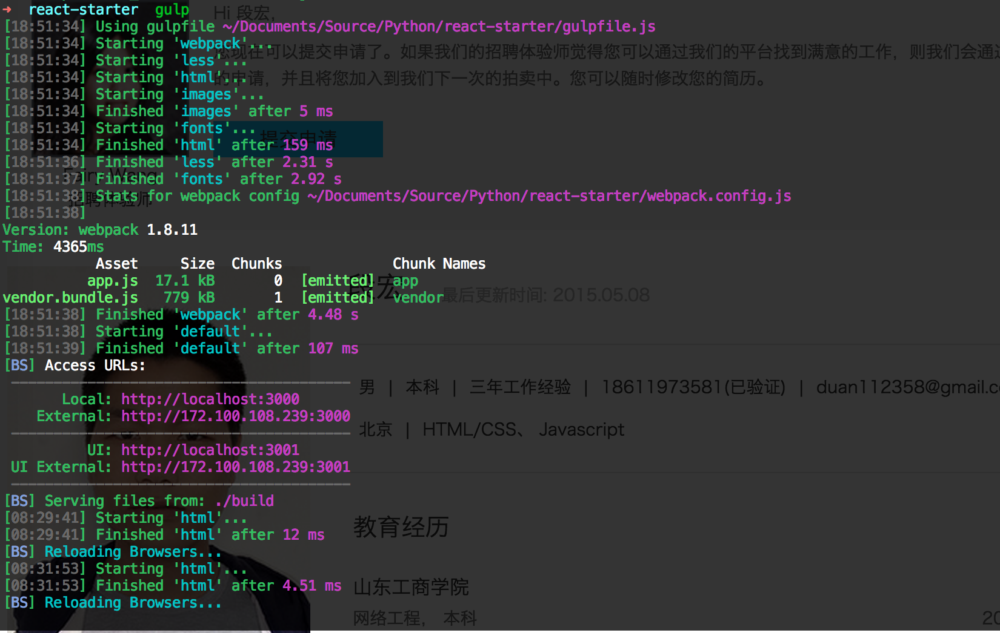
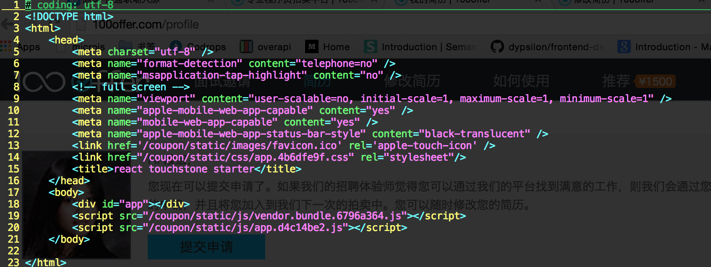

# react-demo
react demo
`less` `reactjs` `webpack` `gulp`

### project init
    npm install

### develop mode
    npm run start
    
  
### release mode
    npm run build

    with persist cache enabled
    
